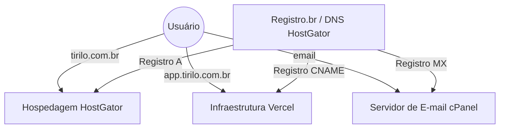

# Configuração de Infraestrutura: Domínio, Hospedagem e Aplicação

Este documento descreve a arquitetura de rede e os registros de DNS para o ecossistema Tirilo, garantindo a coexistência do site institucional, e-mails e a aplicação SaaS.

## 🏗️ Arquitetura Geral

O projeto utiliza uma estrutura híbrida para otimizar custos e performance:

*   **Domínio (Registro.br):** Gerenciado no Registro.br, com servidores de nome (NS) apontados para a HostGator.
*   **Site Institucional & E-mail (HostGator):** Hospedagem principal via cPanel. Gerencia o site raiz, e-mails corporativos e subdomínios técnicos.
*   **Aplicação Frontend (Vercel):** O aplicativo principal (`app.tirilo.com.br`) é hospedado na infraestrutura global da Vercel para máxima performance.

---

## 🌐 Registros de DNS (Configurados no cPanel)

Para manter essa estrutura, os seguintes registros são fundamentais:

| Host / Nome | Tipo | Alvo / Destino | Finalidade |
| :--- | :--- | :--- | :--- |
| `tirilo.com.br` | **A** | `69.6.249.230` | Site Principal na HostGator |
| `www.tirilo.com.br` | **CNAME** | `tirilo.com.br` | Alias para o site principal |
| `app.tirilo.com.br` | **CNAME** | `c563d30bfc4e608a.vercel-dns-017.com` | **Aplicativo na Vercel** |
| `mail.tirilo.com.br`| **A** | `69.6.249.230` | Servidor de E-mail |
| `tirilo.com.br` | **MX** | `mail.tirilo.com.br` | Roteamento de E-mails |

---

## 🛠️ Manutenção e Observações

### 1. Site Institucional e E-mails
Qualquer alteração no registro **A** principal (`@` ou `tirilo.com.br`) afetará a visibilidade do site institucional e a entrega de e-mails. **Não alterar o IP de destino** a menos que deseje mover o site para fora da HostGator.

### 2. Atualizações da Vercel
A Vercel ocasionalmente solicita a atualização de registros CNAME (como a expansão de IPs em Março/2026). Nesses casos, apenas o registro do subdomínio `app` deve ser atualizado no cPanel.

### 3. Redirecionamentos
O cPanel possui um redirecionamento configurado para garantir a navegação segura:
*   `app.tirilo.com.br` -> `https://app.tirilo.com.br/` (301 Permanent)

---

> [!IMPORTANT]
> A configuração do domínio raiz na Vercel poderá aparecer como **"Invalid Configuration"** no painel da Vercel. Isso é normal, pois o domínio raiz aponta intencionalmente para a HostGator.
